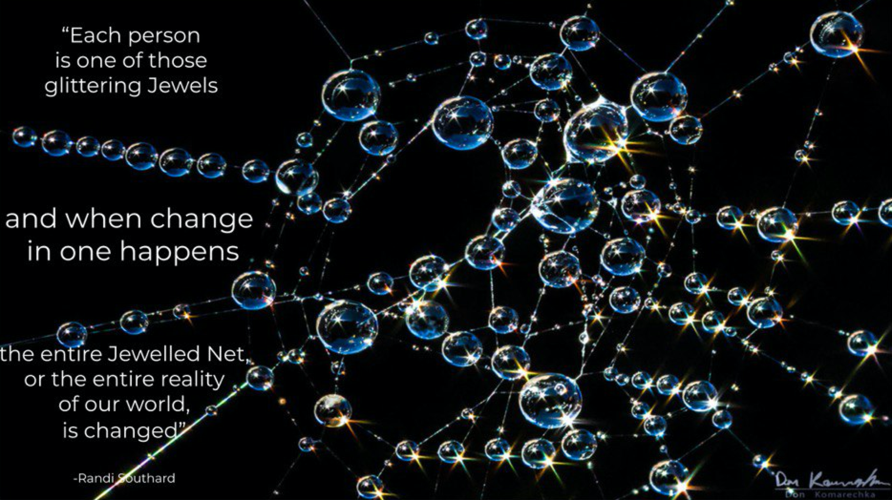

## serialization

will be yaml (looks like toml not so good supported in crystal, unless if we can fix it)

## world of crystal spheres

how is everything connected to each other.

- [topic](topic.md)
  - [epic](epic.md)
    - [story](story.md)
- [site](site.md)     = a (web) site to group & visualize information
- [person](person.md) = a person who can belong to one or more circles
- [circle](circle.md) = group of people

